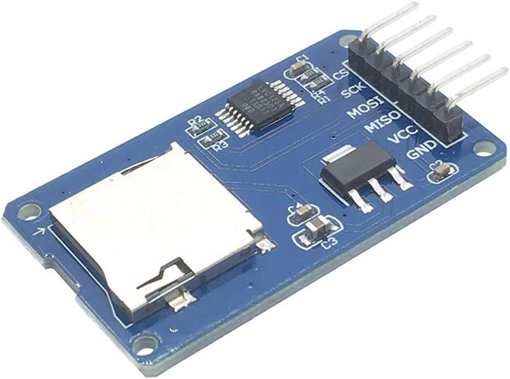
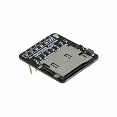
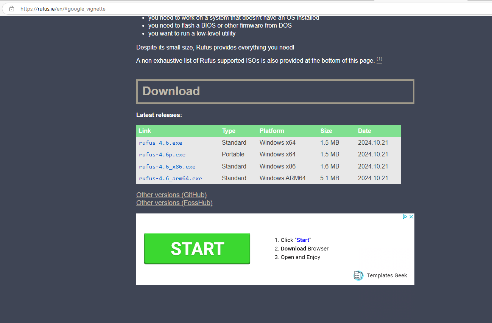
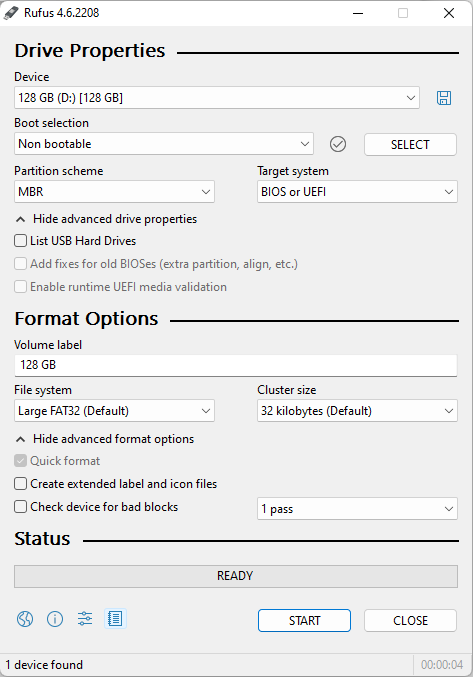
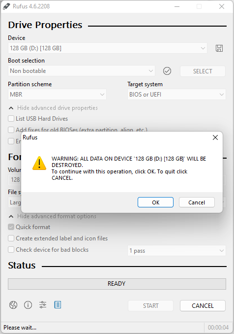
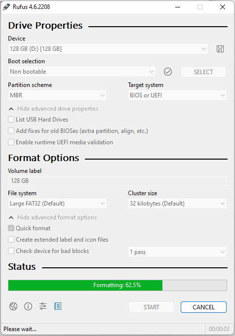
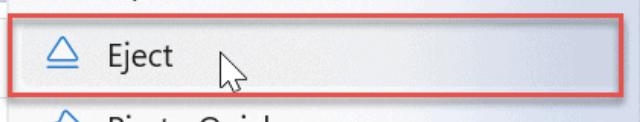

# ESP32 Micro SD Card Example

A simple example of using [`embedded-sdmmc-rs`](https://github.com/rust-embedded-community/embedded-sdmmc-rs) to write data to an SD card on ESP32 with Rust and Embassy.

## What it does

1. Initializes Micro SD card with automatic retries
2. Creates a random CSV filename in the format of "ABC12345.CSV"
3. Writes the CSV header "Timestamp,Counter,Value"
4. Writes the timestamp and latest counter value to the file every second
5. Flushes data every 10 counts to ensure the filesystem's directory entry is updated for this file

## Hardware Setup

- ESP32 development board
- SD card module connected via SPI:
  - CS: GPIO18
  - SCK: GPIO19
  - MISO: GPIO21
  - MOSI: GPIO23

There are lots of options for SD card modules. Here are some that we've tested with:

| Link                                                                                                                                      | Image                                                       |
| ----------------------------------------------------------------------------------------------------------------------------------------- | ----------------------------------------------------------- |
| [Amazon - HiLetgo 5pcs Micro SD Reader Adapter SPI](https://www.amazon.com/HiLetgo-Adater-Interface-Conversion-Arduino/dp/B07BJ2P6X6)     |  |
| [Digi-Key - DFRobot Micro SD Connectivity Evaluation Expansion Board](https://www.digikey.com/en/products/detail/dfrobot/DFR0229/6588460) |              |

## Usage

1. Complete the pre-requisite installations to setup the ESP32 toolchain
   - https://github.com/esp-rs/esp-idf-template#prerequisites
2. Build and run to your ESP32

   ```bash
   . $HOME/export-esp.sh   # Run each time you open a new terminal

   cargo check             # Verify compilation
   cargo build             # Build for target

   cargo run -r            # Use espflash to run on your ESP32
   ```

<br>

<details>
<summary>Expand to see Debug output</summary>

```
ets Jul 29 2019 12:21:46

rst:0x1 (POWERON_RESET),boot:0x13 (SPI_FAST_FLASH_BOOT)
configsip: 0, SPIWP:0xee
clk_drv:0x00,q_drv:0x00,d_drv:0x00,cs0_drv:0x00,hd_drv:0x00,wp_drv:0x00
mode:DIO, clock div:2
load:0x3fff0030,len:6276
load:0x40078000,len:15748
load:0x40080400,len:4
ho 8 tail 4 room 4
load:0x40080404,len:3860
entry 0x4008063c
I (31) boot: ESP-IDF v5.4.1-426-g3ad36321ea 2nd stage bootloader
I (31) boot: compile time Apr 24 2025 15:52:44
I (31) boot: Multicore bootloader
I (34) boot: chip revision: v3.1
I (37) boot.esp32: SPI Speed      : 40MHz
I (40) boot.esp32: SPI Mode       : DIO
I (44) boot.esp32: SPI Flash Size : 4MB
I (48) boot: Enabling RNG early entropy source...
I (52) boot: Partition Table:
I (55) boot: ## Label            Usage          Type ST Offset   Length
I (61) boot:  0 nvs              WiFi data        01 02 00009000 00006000
I (67) boot:  1 phy_init         RF data          01 01 0000f000 00001000
I (74) boot:  2 factory          factory app      00 00 00010000 003f0000
I (81) boot: End of partition table
I (84) esp_image: segment 0: paddr=00010020 vaddr=3f400020 size=020e0h (  8416) map
I (94) esp_image: segment 1: paddr=00012108 vaddr=3ffb0000 size=004dch (  1244) load
I (99) esp_image: segment 2: paddr=000125ec vaddr=40080000 size=01184h (  4484) load
I (108) esp_image: segment 3: paddr=00013778 vaddr=00000000 size=0c8a0h ( 51360)
I (131) esp_image: segment 4: paddr=00020020 vaddr=400d0020 size=0b274h ( 45684) map
I (147) boot: Loaded app from partition at offset 0x10000
I (147) boot: Disabling RNG early entropy source...

==============================
ESP32 SD Card Counter Example
==============================

Generated filename: R2TBDGCM.CSV
Setting up SPI bus for SD card...
    SPI bus configured
Initializing SD Card...
    SD Card ready - size: 238 GB
    Volume 0 opened
    Root directory opened
    CSV file 'R2TBDGCM.CSV' created
    CSV header written
Starting counter loop...

Counter: 1
Counter: 2
Counter: 3
Counter: 4
Counter: 5
```

</details>
<br>
<details>
<summary>Expand to see R2TBDGCM.CSV file we captured</summary>

```csv
Timestamp,Counter,Value
234,count,1
1240,count,2
2245,count,3
3250,count,4
4256,count,5
5261,count,6
6266,count,7
7272,count,8
8278,count,9
9284,count,10
10308,count,11
11317,count,12
12323,count,13
13332,count,14
14336,count,15
15340,count,16
16344,count,17
17348,count,18
18352,count,19
19356,count,20
20375,count,21
21384,count,22
22389,count,23
23394,count,24
24400,count,25
25405,count,26
26410,count,27
27416,count,28
```

</details>

<br>

## Formatting SD Cards

We recommend using a tool like [Rufus](https://rufus.ie/) to format the SD card.

| Step                                                                                                               | Screenshot                                                                                                                                             |
| ------------------------------------------------------------------------------------------------------------------ | ------------------------------------------------------------------------------------------------------------------------------------------------------ |
| 1. Download and install Rufus from https://rufus.ie/                                                               |                                                                                                       |
| 2. Open Rufus and fill out the fields as shown. Ensure you've backed up the data on the SD card before formatting. |    |
| 3. Eject the SD card from your computer                                                                            |                                                                                                             |

## License

[MIT](./LICENSE)

## Contributing

Contributions are welcome! Whether it's bug fixes, feature additions, or documentation improvements, we appreciate your help in making this project better. For major changes or new features, please open an issue first to discuss what you would like to change.
